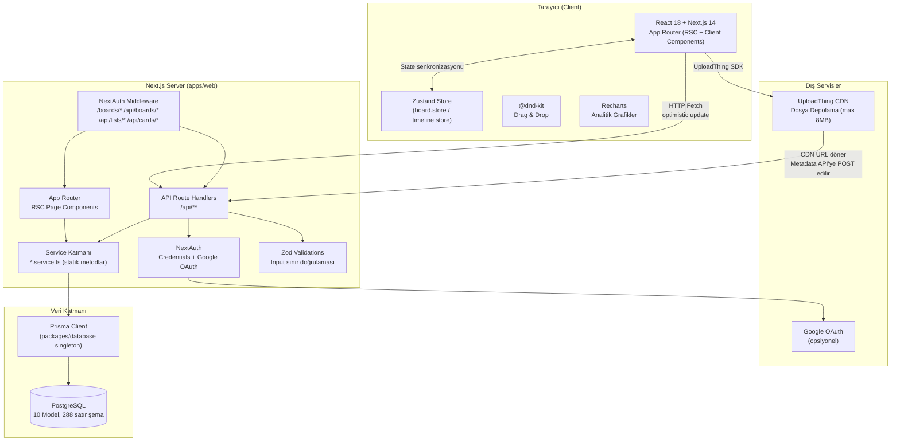

# SYSTEM DESIGN — ÜLGEN

> Tarih: 2026-03-30 | Versiyon: v2.4.0 | Model: claude-sonnet-4-6

---

## 1. SYSTEM OVERVIEW

**Amaç:** ÜLGEN, Trello'nun temel kanban fonksiyonlarını (board/list/card CRUD, drag & drop, etiketler, yorumlar, dosya ekleri) baz alarak üzerine **daily timeline planlama**, **Eisenhower öncelik matrisi**, **checklist**, **Pomodoro zamanlayıcı** ve **kişisel verimlilik analitiği** ekleyen opinionated bir görev yönetim uygulamasıdır.

**Sistem Tipi:** Monolith — full-stack Next.js 14 (App Router) uygulaması; ayrı bir backend servisi yoktur.

**Ölçek Hedefi:** Bireysel + küçük takım kullanımı (~1–50 kullanıcı, ~100 RPS peak, ~1 GB dosya depolama).

---

## 2. HIGH-LEVEL ARCHITECTURE



### Katman Sorumlulukları

| Katman | Bileşen | Sorumluluk |
|--------|---------|------------|
| Client | React Components | UI render, kullanıcı etkileşimi |
| Client | Zustand Stores | Optimistic UI, client-side state cache |
| Client | @dnd-kit | Sürükle-bırak etkileşim yönetimi |
| Server | Next.js Middleware | Route bazlı oturum doğrulama (NextAuth) |
| Server | API Route Handlers | HTTP request/response, Zod validation, auth kontrolü |
| Server | Service Sınıfları | Prisma sorguları, iş mantığı, yetkilendirme |
| Server | NextAuth | Session/JWT yönetimi, OAuth akışı |
| External | UploadThing CDN | Dosya depolama ve sunma |
| Data | Prisma Client | Tip-güvenli ORM, connection pooling |
| Data | PostgreSQL | Kalıcı veri depolama |

---

## 3. COMPONENT DESIGN

### 3.1 Board Module

**Sorumluluk:** Kullanıcının board'larını, listelerini ve kartlarını yönetir; Kanban ve Eisenhower Matrix görünümlerini sunar.

**Bounded Context:**
- Board sahibi ve üyeleri arasındaki erişim kontrolü bu modülde
- Label (etiket) tanımları board seviyesinde, atama kart seviyesinde

**API Kontratı:**
```
GET    /api/boards              → { boards: Board[] }
POST   /api/boards              → createBoardSchema → Board
GET    /api/boards/[id]         → Board + lists + cards + labels (derin nesne)
PATCH  /api/boards/[id]         → updateBoardSchema → Board
DELETE /api/boards/[id]         → 204
POST   /api/boards/[id]/labels  → { name, color } → Label
GET    /api/boards/[id]/labels  → Label[]
```

**Bağımlılıklar:** `board.service.ts` → Prisma → PostgreSQL

---

### 3.2 Card Module

**Sorumluluk:** Kart CRUD'u ve karta bağlı tüm alt varlıkları (yorum, ek, checklist, etiket) yönetir.

**API Kontratı:**
```
GET    /api/cards/[id]                   → Card (tüm ilişkilerle)
PATCH  /api/cards/[id]                   → title? desc? dueDate? dueComplete? position? isCompleted? eisenhowerQuadrant?
POST   /api/cards/[id]/move              → { listId, position }
POST   /api/cards/[id]/comments          → { content } → Comment
POST   /api/cards/[id]/attachments       → { name, url, key, mimeType, size }
POST   /api/cards/[id]/checklists        → { name }
POST   /api/cards/[id]/labels            → { labelId }
DELETE /api/cards/[id]/labels/[labelId]  → 204
```

**Bağımlılıklar:** `card.service.ts`, `attachment.service.ts`, `list.service.ts`

---

### 3.3 Timeline Module

**Sorumluluk:** Kartların günlük/haftalık zaman bloğuna planlanması, status takibi (PLANNED→IN_PROGRESS→COMPLETED), çakışma tespiti ve Pomodoro entegrasyonu.

**API Kontratı:**
```
GET  /api/timeline?date=YYYY-MM-DD                   → TimelineTask[] (günlük)
GET  /api/timeline?startDate=...&endDate=...          → TimelineTask[] (haftalık)
POST /api/timeline                                    → createTimelineTaskSchema → TimelineTask
PATCH /api/timeline/tasks/[id]                        → action: start|pause|complete|skip | reschedule
DELETE /api/timeline/tasks/[id]                       → 204
GET  /api/timeline/unscheduled                        → UnscheduledCard[]
```

**Çakışma Tespiti:** Aynı kullanıcı için overlapping zaman aralığı tespit edilince `409 Conflict` döner; frontend `conflict-modal.tsx` ile Replace/Move/Cancel seçeneği sunar.

**Bağımlılıklar:** `timeline.store.ts`, `timeline.service.ts`

---

### 3.4 Analytics Module

**Sorumluluk:** Kullanıcının görev tamamlama trendi, tahmin doğruluğu, saat bazlı verimlilik dağılımı ve streak hesaplamasını sunar.

**API Kontratı:**
```
GET /api/analytics/personal?range=week|month|3month|all
→ {
    completedByDay, boardDistribution, hourlyHeatmap,
    estimationAccuracy, streak, totalCompleted
  }
```

**Bağımlılıklar:** Recharts (BarChart, PieChart, LineChart, custom Heatmap)

---

### 3.5 Auth Module

**Sorumluluk:** Kimlik doğrulama (Credentials + Google OAuth), session yönetimi, kayıt akışı.

**API Kontratı:**
```
POST /api/auth/register         → registerSchema → User (201)
POST /api/auth/[...nextauth]    → NextAuth internal (login, callback, signout, session)
```

**Bağımlılıklar:** NextAuth 4.24, PrismaAdapter, bcryptjs, JWT

---

## 4. DATA ARCHITECTURE

### 4.1 Database Seçimi

| Kriter | PostgreSQL | Gerekçe |
|--------|-----------|---------|
| İlişkisel veri | ✅ | Board→List→Card hiyerarşisi + çok-çok ilişkiler (User↔Card, Card↔Label) |
| ACID garantisi | ✅ | Kart taşıma (position güncelleme) atomic olmalı |
| JSON desteği | ✅ | Gelecek genişlemeler için |
| Prisma uyumu | ✅ | Tip güvenli ORM, migration desteği |

### 4.2 Entity-Relationship Özeti

```
User ──┬── owns ──────────────── Board ──┬── has ─── List ──── Card ──┬── has ─── Comment
       │                                 │                             ├── has ─── Attachment
       ├── memberOf (BoardMember) ────── Board                        ├── has ─── Checklist ── ChecklistItem
       ├── assignedTo (Card[])           └── has ─── Label            ├── assigned (CardLabel) ── Label
       ├── createdCards (Card[])                                       └── has ─── TimelineTask
       └── has ──────────────── TimelineTask ─── Card
                                               └── Board
```

**Kardinaliteler:**
- User : Board = 1:N (owner) ve M:N (member via BoardMember)
- Board : List = 1:N
- List : Card = 1:N
- Card : User = M:N (assignees via implicit join table)
- Card : Label = M:N (via CardLabel junction)
- Card : TimelineTask = 1:N (bir kart birden fazla güne planlanabilir)

### 4.3 Kritik İndeksler

```sql
User:         @@index([email])
Board:        @@index([ownerId]), @@index([createdAt])
BoardMember:  @@index([boardId]), @@index([userId]), @@unique([boardId, userId])
List:         @@index([boardId, position])
Card:         @@index([listId, position]), @@index([creatorId])
Comment:      @@index([cardId, createdAt])
Attachment:   @@index([cardId, createdAt])
TimelineTask: @@index([userId, scheduledDate]), @@index([cardId])
Checklist:    @@index([cardId, position])
Label:        @@index([boardId])
CardLabel:    @@index([cardId]), @@index([labelId])
```

### 4.4 Cache Stratejisi

Mevcut versiyonda sunucu tarafı önbellekleme **yoktur**; tüm state client-side Zustand store'da tutulur.

| Katman | Mekanizma | Kullanım |
|--------|----------|---------|
| Client | Zustand in-memory | Board state, optimistic updates |
| Client | Zustand in-memory | Timeline tasks, unscheduled cards |
| Server | Yok (şimdilik) | Her API çağrısı Prisma'ya gider |
| HTTP | Next.js RSC cache | Sadece statik sayfalarda (login/register) |

**Not:** Yüksek yük senaryosunda Redis + `unstable_cache` (Next.js) ile board bazlı önbellekleme eklenebilir.

### 4.5 Data Flow

```
[User Action]
  → Zustand optimistic update (UI anında güncellenir)
  → fetch() → API Route → Zod validate → Service → Prisma → PostgreSQL
  ← 200/201 (success) → Zustand state confirm
  ← 4xx/5xx (error) → Zustand rollback + sonner toast (Türkçe hata mesajı)
```

**Dosya Yükleme (2 aşamalı):**
```
[File Select] → UploadThing SDK → CDN (utfs.io)
             ← { url, key }
→ POST /api/cards/[id]/attachments { url, key, name, mimeType, size }
→ Prisma Attachment kaydı oluşturulur
```

---

## 5. API DESIGN

### 5.1 Stil ve Gerekçe

**REST** seçildi. Gerekçe:
- Next.js App Router file-based routing ile doğal uyum
- İstek/yanıt yapısı basit CRUD operasyonları için yeterli
- Takım boyutu (solo dev) ve zaman kısıtı GraphQL/gRPC genel gider maliyetini haklı kılmıyor

### 5.2 Auth Mekanizması

| Adım | Detay |
|------|-------|
| Oturum açma | POST /api/auth/[...nextauth] (credentials veya OAuth callback) |
| Token tipi | JWT (cookie'de `next-auth.session-token`) |
| Doğrulama | NextAuth middleware → `getServerSession(authOptions)` her API route'da |
| Yetkilendirme | Board member kontrolü: `board.members.some(m => m.userId === session.user.id)` |

**Middleware Koruma Matrisi:**

| Route Pattern | Middleware | Route Handler |
|--------------|-----------|--------------|
| `/boards/*` | NextAuth JWT check | — |
| `/api/boards/*` | NextAuth JWT check | Board member check |
| `/api/lists/*` | NextAuth JWT check | Board member check (list.board) |
| `/api/cards/*` | NextAuth JWT check | Board member check (card.list.board) |
| `/api/timeline/*` | Middleware YOK | `getServerSession` + userId check |
| `/api/analytics/*` | Middleware YOK | `getServerSession` + userId check |

### 5.3 Rate Limiting

Mevcut versiyonda rate limiting **uygulanmamaktadır**. Tek kullanıcı / küçük takım hedefi için kabul edilebilir. Üretim için `@upstash/ratelimit` (Redis tabanlı) önerilir.

### 5.4 Versiyonlama

URL versiyonlama yapılmamıştır (`/api/v1/...`). Monolith + tek geliştirici modelinde gerek duyulmamıştır; breaking change durumunda yeni route oluşturulur.

### 5.5 Hata Yanıt Formatı

```json
{ "error": "Türkçe hata mesajı" }   // 400/401/403/404/409/500
```

Başarılı yanıtlar doğrudan entity döner (envelope yok).

---

## 6. INFRASTRUCTURE & DEPLOYMENT

### 6.1 Monorepo Yapısı

```
Turborepo (pnpm workspaces)
├── apps/web           → Next.js (build: next build)
├── packages/database  → Prisma client (build: tsc)
├── packages/eslint-config
└── packages/typescript-config
```

**Turbo Pipeline:**
```json
build    → depends on ^build (database önce build edilir)
dev      → persistent, no cache
db:push  → no cache (her zaman çalıştırılır)
```

### 6.2 Ortam Yönetimi

| Değişken | Lokasyon | Açıklama |
|---------|---------|---------|
| `DATABASE_URL` | `packages/database/.env` + `apps/web/.env` | PostgreSQL bağlantı dizesi |
| `NEXTAUTH_URL` | `apps/web/.env` | Uygulama base URL |
| `NEXTAUTH_SECRET` | `apps/web/.env` | Min 32 karakter JWT secret |
| `GOOGLE_CLIENT_ID/SECRET` | `apps/web/.env` | Opsiyonel OAuth |
| `UPLOADTHING_TOKEN` | `apps/web/.env` | CDN erişim token'ı |

### 6.3 Deployment Stratejisi (Hedef)

| Katman | Platform | Not |
|--------|---------|-----|
| Next.js App | Vercel | Otomatik edge/serverless deploy, `next build` output |
| PostgreSQL | Supabase / Neon / Railway | Managed PostgreSQL |
| Dosya Depolama | UploadThing CDN | Zaten entegre |

### 6.4 CI/CD Pipeline (Mevcut — Manuel)

```bash
# Yeni özellik geliştirme akışı:
pnpm db:generate    # Schema değişince Prisma client yenile
pnpm db:push        # Migration uygula
pnpm dev            # Geliştir
pnpm build          # Build doğrula (tsc --noEmit + next build)
```

Otomatik CI (GitHub Actions) henüz kurulmamıştır.

### 6.5 Container Stratejisi

Docker kullanılmamaktadır. PostgreSQL yerel kurulum veya managed servis kullanılır.

---

## 7. SECURITY

### 7.1 Authentication & Authorization Akışı

```
[Browser] POST /api/auth/[...nextauth]
    ↓
[NextAuth] Credentials: bcrypt.compare(password, hash)
    ↓ başarılı
[NextAuth] JWT oluştur { id, email, name } → HttpOnly cookie
    ↓
[Sonraki istek] Middleware: withAuth() JWT cookie doğrular
    ↓
[API Route] getServerSession(authOptions) → session.user.id
    ↓
[Service] prisma.board.findFirst({ where: { members: { some: { userId } } } })
```

### 7.2 Şifre Güvenliği

| Önlem | Uygulama |
|-------|---------|
| Hashing | `bcryptjs.hash(password, 10)` — kayıtta |
| Doğrulama | `bcryptjs.compare(plain, hash)` — girişte |
| Düz metin depolama | Asla — `password` alanı hash'li |
| OAuth hesapları | `password: null` — credentials ile giriş reddedilir |

### 7.3 Input Validation

Tüm API yazma uç noktaları (POST/PATCH/PUT) Zod şeması ile validate edilir (`lib/validations.ts`). Validate hatası → 400 döner, DB'ye ulaşılmaz.

### 7.4 Dosya Yükleme Güvenliği

| Kontrol | Değer |
|---------|-------|
| Maksimum boyut | 8 MB (`MAX_ATTACHMENT_SIZE`) |
| İzin verilen MIME tipleri | `ALLOWED_ATTACHMENT_MIME_TYPES` listesi |
| Depolama | UploadThing CDN (uygulama sunucusunda dosya yok) |
| Silme | UploadThing `deleteFiles(key)` + Prisma cascade |

### 7.5 Bilinen Tehdit Vektörleri ve Önlemler

| Tehdit | Önlem | Durum |
|--------|-------|-------|
| SQL Injection | Prisma ORM — parametrik sorgular | ✅ Güvenli |
| XSS | React JSX string escaping | ✅ Varsayılan güvenli |
| CSRF | NextAuth cookie samesite + CSRF token (built-in) | ✅ |
| Unauthorized board access | Board member kontrolü her servis metodunda | ✅ |
| Brute force login | Rate limiting YOK | ⚠️ Eksik |
| Secrets in code | Tüm secretlar `.env` dosyalarında | ✅ |
| UploadThing path traversal | Key tabanlı silme, URL CDN'den gelir | ✅ |

---

## 8. SCALABILITY & PERFORMANCE

### 8.1 Mevcut Darboğaz Analizi

| Darboğaz | Neden | Çözüm |
|---------|-------|-------|
| `GET /api/boards/[id]` | Tüm listeler + kartlar + label'lar tek sorguda derin include | Lazy loading veya pagination |
| `GET /api/analytics/personal` | Tüm TimelineTask satırları kullanıcı için çekilir | Date-range index + aggregation query |
| Timeline çakışma tespiti | Her POST'ta O(n) query (userId+date için tüm task'lar) | Redis sorted set ile zaman aralığı indexi |
| Prisma singleton dev hot-reload | `globalThis` pattern ile çözülmüş | ✅ |

### 8.2 Optimistic UI Stratejisi

Board ve Timeline store'larında tüm mutasyonlar **önce Zustand'da** uygulanır, API başarısız olursa revert edilir. Bu sayede UI latency algısı sıfıra yakındır.

```
action() {
  const previous = get().tasks;             // snapshot al
  set({ tasks: updatedTasks });             // optimistic
  try {
    await api.patch(...)                    // sunucu
  } catch {
    set({ tasks: previous });               // revert
    toast.error('...');
  }
}
```

### 8.3 Scaling Senaryoları

| Senaryo | Yaklaşım |
|---------|---------|
| ~50 kullanıcıya kadar | Mevcut monolith yeterli |
| ~500 kullanıcı | Vercel serverless auto-scale, managed PostgreSQL connection pooling (PgBouncer) |
| ~5000 kullanıcı | Redis önbellek (board state), Analytics sorguları materyalize edilmiş view'a taşınır |
| File storage | UploadThing zaten CDN, ölçeklenir |

### 8.4 Async İşlem Stratejisi

Şu an async işlem kuyruğu yoktur. Tüm operasyonlar senkron HTTP request-response döngüsündedir. Gelecekte zaman alacak işlemler (toplu import, analitik hesaplama) için `@vercel/queue` veya Inngest önerilebilir.

---

## 9. MONITORING & OBSERVABILITY

### 9.1 Mevcut Durum

| Araç | Durum | Not |
|------|-------|-----|
| Server-side loglama | ❌ Yok | Production'da `console.log` yasak (CLAUDE.md kuralı) |
| Error tracking (Sentry vb.) | ❌ Yok | — |
| APM | ❌ Yok | — |
| Health check endpoint | ❌ Yok | — |
| NextAuth debug logs | ✅ Dev-only | `debug: process.env.NODE_ENV === 'development'` |

### 9.2 Önerilen Gözlemlenebilirlik Katmanı

```
[Next.js Server] → winston / pino logger
    ↓
[Vercel Log Drains] veya [Logtail] → Yapılandırılmış log arama
[Sentry] → Exception tracking + performance tracing
[Uptime Robot] → /api/health endpoint izleme
```

**Önerilen Health Check Endpoint:**
```
GET /api/health
→ { status: "ok", db: "connected", uptime: 123 }
```

### 9.3 Client-Side Hata Yönetimi

- **sonner** (toast) kütüphanesi ile kullanıcıya Türkçe hata mesajları
- Optimistic update rollback mekanizması (store'larda try/catch)
- API hataları için HTTP status code'a göre differentiated mesajlar (409 → çakışma modal'ı)

---

## 10. TRADE-OFFS & DECISIONS

### Mimari Kararlar

| Karar | Seçilen | Alternatif | Trade-off |
|-------|---------|-----------|---------|
| **Mimari** | Monolith (Next.js full-stack) | Ayrı BE (Express/NestJS) + FE (React) | (-) Sınırları bulanık, (+) Dağıtım basit, geliştirme hızlı |
| **Auth** | NextAuth JWT | Custom JWT / Supabase Auth | (-) JWT revoke zor, (+) Hazır OAuth entegrasyonu |
| **State** | Zustand | React Query / TanStack Query | (-) Manuel cache invalidation, (+) Basit, boyut küçük (8kB) |
| **ORM** | Prisma | Drizzle / TypeORM / raw SQL | (-) Bundle boyutu büyük, (+) Tip güvenliği mükemmel, migration sistemi |
| **File storage** | UploadThing | S3 + presigned URL | (-) Vendor lock-in, (+) Next.js entegrasyonu çok kolay |
| **Monorepo** | Turborepo + pnpm | Nx / Lerna | (-) Öğrenme eğrisi, (+) Incremental build cache, workspace yönetimi |
| **DB** | PostgreSQL | MySQL / SQLite | (-) Kurulum gerektirir, (+) JSONB desteği, Prisma 1st-class |
| **Drag & Drop** | @dnd-kit | react-beautiful-dnd | (+) Accessibility, PointerSensor özelleştirme, aktif bakım |
| **Charts** | Recharts | Chart.js / Visx | (+) React-first API, (-) Bundle boyutu (400kB+) |

### Özellik Bazlı Kararlar

| Karar | Gerekçe |
|-------|---------|
| **TimelineTask ayrı model** (Card'ın alanı değil) | Bir kart birden fazla güne planlanabilir (1:N) |
| **CardLabel junction tablosu** | String[] yerine cascade delete + zengin metadata desteği için |
| **isCompleted Board-level flag** | Timeline dışlama ve board filtresi için ayrı bir sinyal gerekiyordu (dueComplete != isCompleted) |
| **Service katmanı** (statik metodlar) | API route'ları ince, test edilebilir iş mantığı için; constructor tabanlı sınıf gereksiz overhead |
| **Optimistic UI** | Timeline için Pomodoro timer latency algısını sıfırlamak kritik |
| **Türkçe hata mesajları** | Hedef kullanıcı kitlesi Türkçe konuşuyor |

---

## EKLER

### Prisma Schema Model Sayımı

| Model | Alanlar | İlişkiler | İndeksler |
|-------|---------|-----------|---------|
| User | 8 | 7 | 1 |
| Board | 6 | 5 | 2 |
| BoardMember | 3 | 2 | 2 + 1 unique |
| List | 4 | 2 | 1 |
| Card | 9 | 7 | 2 |
| Comment | 4 | 2 | 2 |
| Attachment | 7 | 2 | 2 |
| Checklist | 4 | 2 | 1 |
| ChecklistItem | 5 | 1 | 1 |
| Label | 4 | 2 | 1 |
| CardLabel | 2 | 2 | 2 + 1 composite PK |
| TimelineTask | 11 | 3 | 2 |

### Paket Ağırlıkları (Tahmini gzip)

| Paket | Boyut | Amaç |
|-------|-------|-------|
| next | ~120kB | Framework |
| recharts | ~400kB | Analitik grafikler |
| @dnd-kit/core + sortable | ~45kB | Drag & drop |
| zustand | ~8kB | State |
| @radix-ui/* | ~80kB (toplam) | UI primitives |
| date-fns | ~30kB (tree-shaken) | Tarih formatlama |

---

*Bu doküman `c:\Users\turki\Documents\PROJELER\ÜLGEN\trello-clone\SYSTEM-DESIGN.md` konumuna kaydedilmiştir.*
*Üretici: Claude Sonnet 4.6 — 2026-03-30*
